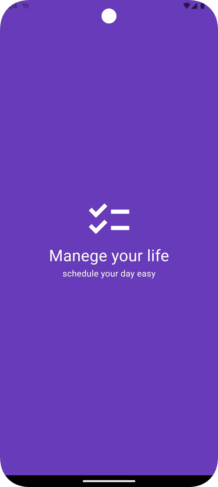
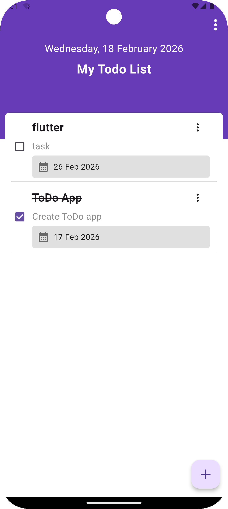
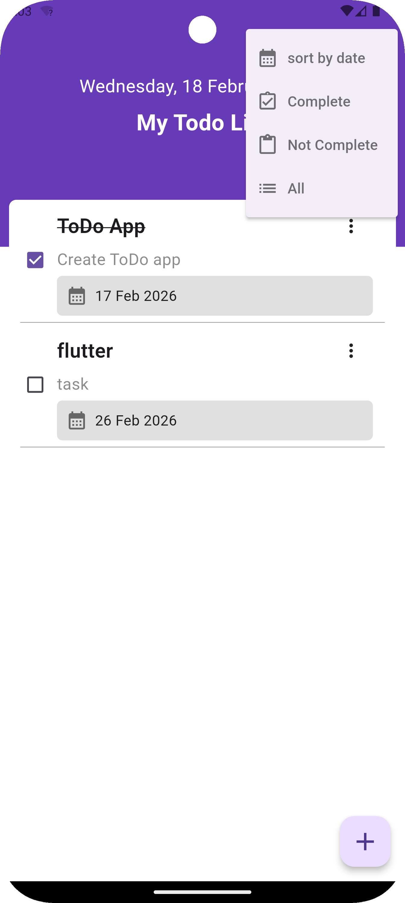
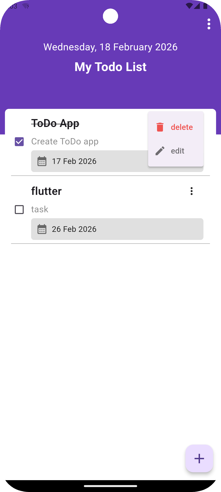
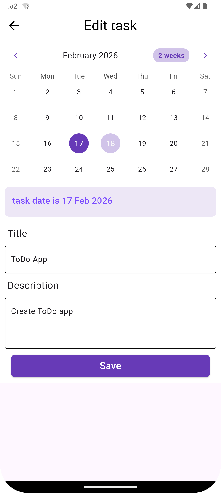
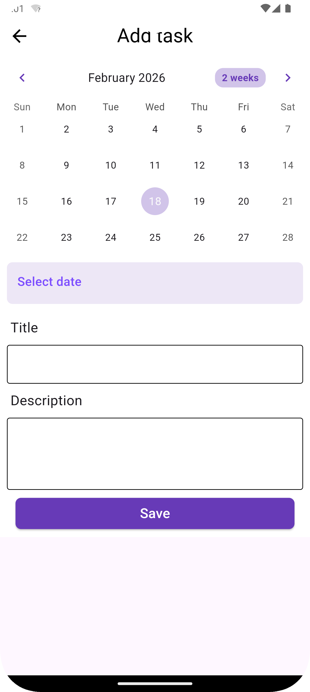

# 📝 To-Do App

[](https://flutter.dev/)

A simple, fast, and lightweight **To-Do Flutter app** built with **Hive** for local storage and **Provider** for state management.  
Perfect for managing your daily tasks efficiently, offline and without any complex setup.

---

## 📦 Features

- ✅ Add, edit, and delete tasks
- ✅ Mark tasks as completed
- ✅ Persistent local storage using Hive
- ✅ Sort tasks by date
- ✅ Clean and simple UI
- ✅ App launcher icon and ready for release
- ✅ Works fully offline

---

## 🛠 Built With

- [Flutter](https://flutter.dev/) - Cross-platform framework
- [Hive](https://pub.dev/packages/hive) - Lightweight NoSQL local database
- [Provider](https://pub.dev/packages/provider) - State management
- Dart language

---

## 🖼 Screenshots

| Splash Screen | Home Screen | Features |
|---------------|------------|---------|
|  |  |  |

| Edit & Delete | Edit Task | Add Task |
|---------------|-----------|---------|
|  |  |  |


---

## ⚡ Getting Started

### Prerequisites

- Flutter >= 3.x
- Dart SDK
- Android Studio or VS Code

---

### Installation

1. Clone the repository:

```bash
    git clone https://github.com/YourUsername/todo_app.git
    cd todo_app
    flutter pub get
    flutter run

